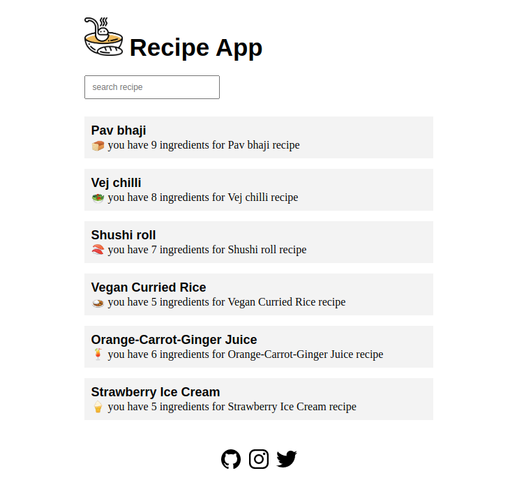
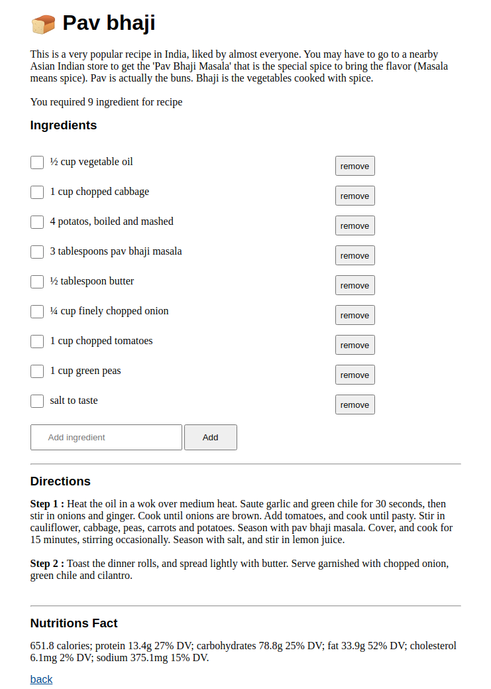

# Recipe App

#### Description:

In this app you can try to make dish with recipe and add your own ingredients in the recipe with list tick and untick and also you will get Facts for a recipe and nutritions also.

For live preview [click here][ralink]

#### Project Screen Shot's

#### Languages that are used:

#### Installation and Setup Instructions
Clone down this repository. You will need `node` and `npm` installed globally on your machine.  

Installation:

`npm install`  

To Run Test Suite:  

`npm test`  

To Start Server:

`npm start`  

To Visit App:

`localhost:3000`  

#### Thanks
Thanks for viewing over project if you like it you can check out other projects [click here](https://www.github.com/tashvikb).

[ralink]:https://recipe-app-tashvikb.herokuapp.com/
